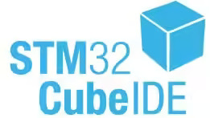

# Hi there, I'm Ahmed! 👋

I’m a strong self-learner who can dive deep into a lot of documentation to extract valuable information. I’m always excited to learn more in different fields. I see myself as a joker player on the team, ready to learn things outside my major field to help fill gaps. My verstile skills helps me a lot in any needs.
I'm always open for new opportunities so don't hesitate to call me.

# 🔭 Interests
- Machine Learning & Large Language Models (LLMs)
- Statistical Analysis
- Embedded Systems and Building Servers
- AUTOSAR
- Desktop Programming
- And much more!

# 🤹🏻 Skills
## Programming Languages
  
  
  
  
  

## 🦾 Embedded Systems
     
  
  
  
  
  

## 🧠 Data Science & Machine Learning
  
  
   
  
  
  
  
   
  
   
  
  

## ☁️ AWS Cloud
   
  
  
  
  
  
  
  
  
   
  The list Doesn't End Here !
 <!-- 
  
  
-->
## Other Skills 
  
  

## 🏅 Badges
  
     
  
  
  

## 📫 How to reach me
Feel free to connect with me on [LinkedIn](www.linkedin.com/in/ahmed-sabry-sl).

